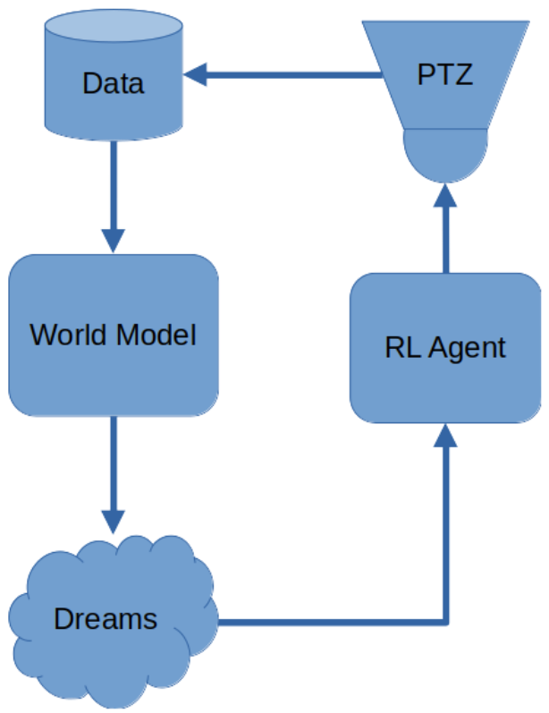
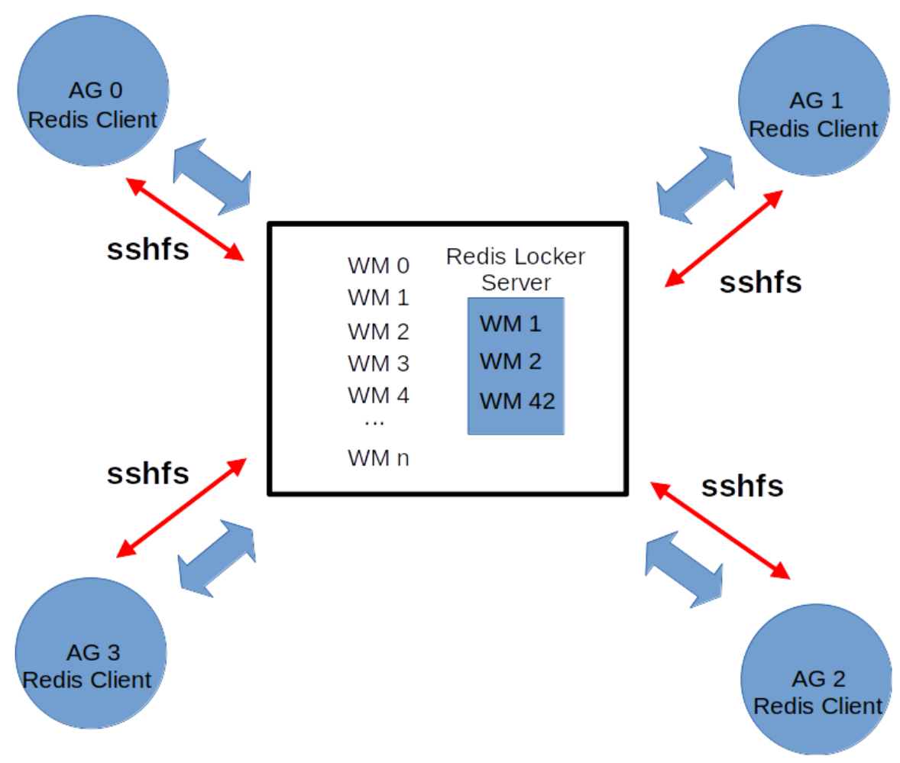

# Pan Tilt Zoom Joint Embedding Predictive Architecture (PTZJEPA)

## Overview
The PTZJEPA is a Pan Tilt Zoom Joint Embedding Predictive Architecture that uses a joint embedding predictive architecture (JEPA) to learn a world model of the environment (the camera view) and a reinforcement learning agent to control the camera.
The joint embedding predictive architecture (JEPA) is a neural network that learns to predict the next internal representation (embedding vector) o the next image given the current image, the current camera position and the current action of the camera. This is basically a world model of the environment (the camera view) the learns to predict the camera dynamics.
This is biologically plausible in the sense that motor commands (actions to control the camera) play the role of predictions in biological systems (such as mammals) and the world model (the JEPA) learns to predict the next internal representation (embedding vector) of the next image given the current image, the current camera position and the current action of the camera.

The Reinforcement learning agent is trained with the world model (the JEPA) and learns to move the camera to locations which are difficult for the world model to predict. The agent learns to move the camera to locations in which the world model has poor performance.

The software in this repository is designed to train several edge agents running distributedly in different camera locations.
The federated learning aspect of the PTZJEPA allows the agents to learn from each other by sharing their world models and their experiences. This is done by using a redis server to synchronize the access to the world models and the experiences of the agents.

## Buiding the PTZJEPA

To build the PTZJEPA and push it to dockerhub, you need to have Docker installed in your local machine. Then, you can run the following command:

```bash
sudo docker buildx build --platform=linux/amd64 -t your_dockerhub_username/ptzjepa -f Dockerfile --push .
```

Let's break down the command:

- `sudo docker buildx build`: This command is used to build a Docker image using the BuildKit feature of Docker. The `buildx` command allows for building images for multiple platforms.

- `--platform=linux/amd64`: This flag specifies the target platform for the image. In this case, it is set to `linux/amd64`, which is a common architecture for many servers and desktops.

- `-t your_dockerhub_username/ptzjepa`: This flag tags the image with a name. Replace `your_dockerhub_username` with your actual Docker Hub username. The image will be named `ptzjepa`.

- `-f Dockerfile`: This flag specifies the Dockerfile to use for building the image. The Dockerfile contains instructions on how to build the image.

- `--push`: This flag tells Docker to push the built image to a Docker registry (like Docker Hub) after building it.

- `.`: This dot at the end specifies the build context, which is the current directory. Docker will look for the Dockerfile and any files it needs in this directory.


once the build is done and the image is pushed to your DockerHub, you can run the following command to pull the image in a dell blade server:

```bash
sudo docker image pull your_dockerhub_username/ptzjepa
```
This command pulls the Docker image from Docker Hub to your local machine. The image will be stored locally and can be run in a container.
Let's break down the command:

- `sudo docker image pull`: This command is used to pull a Docker image from a registry (like Docker Hub) to your local machine.

- `your_dockerhub_username/ptzjepa`: This specifies the name of the image to pull. Replace `your_dockerhub_username` with your actual Docker Hub username. The image name is `ptzjepa`.


## Running the PTZJEPA container on a Dell Blade Server

To run the PTZJEPA container on a Dell Blade Server, you can run the following command:

```bash
sudo docker run --gpus all --privileged -it -v /path/to/jepa/persistece/folder:/persistence -v /path/to/ptzjepa:/app your_dockerhub_username/ptzjepa:latest bash
```
Let's break down the command:

- `sudo docker run`: Runs a new Docker container with elevated privileges.

- `--gpus all`: Allocates all available GPUs to the container. This is useful if your Jupyter notebooks or computations require GPU acceleration.

- `--privileged`: Grants extended privileges to the container. This allows the container to access remote devices (such as cameras or the redis server) and perform operations that require elevated permissions.

- `-it`: Runs the container in interactive mode with a pseudo-TTY (terminal). This is useful for commands that require user interaction or for debugging.

- `-v /path/to/jepa/persistece/folder:/persistence`: Mounts the host directory specified by `/path/to/jepa/persistece/folder` to the container’s `/persistence` directory. This makes the files in `/path/to/jepa/persistece/folder` accessible from inside the container.

- `-v /path/to/ptzjepa:/app`: Mounts the subdirectory ptzjepa (inside `/path/to/ptzjepa`) to `/app` inside the container. Often, this might be where your application or code resides.

- `your_dockerhub_username/ptzjepa:latest`: Specifies the Docker image to use. Replace `your_dockerhub_username` with your actual Docker Hub username. The tag latest indicates that you’re using the most recent version of the image.

- `bash`: This is the command that will be executed inside the container. In this case, it starts a bash shell. This allows you to interact with the container's file system and run commands as if you were on a regular Linux machine.


The command above will run the container in bash mode.

To run the PTZJEPA in the container, you can run the following command:

```bash
sudo docker run --privileged --rm --gpus all -v /path/to/jepa/persistece/folder:/persistence -v /path/to/ptzjepa:/app your_dockerhub_username/ptzjepa:latest python /app/main.py -tp -cb 0 -it 20 -mv 20 -un camera_username -pw camera_password -ip xxx.xxx.xx.xx -rm lifelong --track_all -ki --debug 2>&1 | tee /path/to/log.out
```

where `/path/to/jepa/persistece/folder` is the path to the folder where the JEPA persistence files are stored and `/path/to/ptzjepa` is the path to the PTZJEPA folder.

Let's break down the command:
- `sudo docker run`: Runs a new Docker container with elevated privileges.
- `--privileged`: Grants extended privileges to the container. This allows the container to access remote devices (such as cameras or the redis server) and perform operations that require elevated permissions.
- `--rm`: Automatically removes the container once it stops. This prevents leftover containers from taking up resources.
- `--gpus all`: Allocates all available GPUs to the container. This is useful if your Jupyter notebooks or computations require GPU acceleration.
- `-v /path/to/jepa/persistece/folder:/persistence`: Mounts the host directory specified by `/path/to/jepa/persistece/folder` to the container’s `/persistence` directory. This makes the files in `/path/to/jepa/persistece/folder` accessible from inside the container.
- `-v /path/to/ptzjepa:/app`: Mounts the subdirectory ptzjepa (inside `/path/to/ptzjepa`) to `/app` inside the container. Often, this might be where your application or code resides.
- `your_dockerhub_username/ptzjepa:latest`: Specifies the Docker image to use. Replace `your_dockerhub_username` with your actual Docker Hub username. The tag latest indicates that you’re using the most recent version of the image.
- `python /app/main.py`: Runs the main Python script located in the `/app` directory of the container.

- `-tp`: This flag is used to track the camera position.

- `-cb 0`: This flag is used to set the camera brand to 0. (HANWHA PTZ camera)

- `-it 20`: This flag is used to set the number of iterations to 20.

- `-mv 20`: This flag is used to set the number of movements in each iteration to 20.

- `-un camera_username`: This flag is used to set the camera username.

- `-pw camera_password`: This flag is used to set the camera password.

- `-ip xxx.xxx.xx.xx`: This flag is used to set the camera IP address.

- `-rm lifelong`: This flag is used to set the training mode in lifelong mode.

- `--track_all`: This flag is used to track all the camera positions, actions from the RL agent and the images collected by the camera as well as all the training steps.

- `-ki`: This flag is used to keep the images collected by the camera.

- `--debug`: This flag is used to set the debug mode.

- `2>&1 | tee /path/to/log.out`: This part redirects both standard output and standard error to a log file located at `/path/to/log.out`. The `tee` command allows you to see the output in the terminal while also saving it to the specified log file.


The persistence folder should contain the following structure:

```
.
./collected_imgs
./collected_commands
./collected_positions
./collected_embeds
./world_models
./agents
./progress_model_names.txt
```


### Explaining the lifelong training mode

In the first figure below we show the training process of the PTZJEPA in a lifelong training mode. 
The world model is trained with the images collected by the camera.
The world model is a joint embedding predictive architecture (JEPA) that learns to predict the next image given the current image, the current camera position and the current action of the camera.

Once the world model is trained, it is used to generate dreams. The dreams are sequences of internal representations (embedding vectors) that are then used to train the reinforcement learning agent.

The reinforcement learning agent is trained with the dreams generated by the world model. The agent learns to predict the next action given the current state of the camera (the current image and the current camera position).
Actions are taken by the agent to move the camera to positions in which the world model has poor performance. 
The agent generates sequences of actions which are difficult for the world model to predict. The agent learns to move the camera to positions in which the world model has poor performance.




## Visualizing the PTZJEPA outputs

From the Dell Blade Server, you can run the following command to activate the juptyer notebook:

```bash
ROOTDIR=/path/to/ptzjepa/parent/folder
```

```bash
sudo docker run --name jupyter --rm --gpus all -v $ROOTDIR:/envroot -v $ROOTDIR/ptzjepa:/app -it -p 8888:8888 your_dockerhub_username/ptzjepa:latest bash -c "pip install jupyter matplotlib scikit-learn && jupyter-lab --port 8888 --no-browser --allow-root --ip 0.0.0.0"
```

Then, on another terminal window, you can run the following command:

```bash
ssh -L 8888:localhost:8888 waggle-dev-node-v010
```


### 1- Setting Up the Environment Variable

```bash
ROOTDIR=/path/to/ptzjepa/parent/folder
```

Purpose: This line assigns the path `/path/to/ptzjepa/parent/folder` to an environment variable named `ROOTDIR`.

Why? Later in the command, we use `$ROOTDIR` to refer to this directory. This helps avoid typing the full path multiple times and makes the command more flexible.


### 2- Running the Docker Container

```bash
sudo docker run --name jupyter --rm --gpus all -v $ROOTDIR:/envroot -v $ROOTDIR/ptzjepa:/app -it -p 8888:8888 your_dockerhub_username/ptzjepa:latest bash -c "pip install jupyter matplotlib scikit-learn && jupyter-lab --port 8888 --no-browser --allow-root --ip 0.0.0.0"
```

This is a long command. Let’s dissect it piece by piece:

a. Docker Command and Flags

`sudo docker run`:
Runs a new Docker container. sudo is used to run Docker with elevated privileges.

`--name jupyter`:
Names the container "jupyter". This makes it easier to refer to the container later.

`--rm`:
Automatically removes the container once it stops. This prevents leftover containers from taking up resources.

`--gpus all`:
Allocates all available GPUs to the container. This is useful if your Jupyter notebooks or computations require GPU acceleration.

b. Volume Mounting with `-v`
`-v $ROOTDIR:/envroot`:
Mounts the host directory specified by `$ROOTDIR` to the container’s `/envroot` directory. This makes the files in `$ROOTDIR` accessible from inside the container.

`-v $ROOTDIR/ptzjepa:/app`:
Mounts the subdirectory ptzjepa (inside `$ROOTDIR`) to `/app` inside the container. Often, this might be where your application or code resides.

c. Interactive and Port Flags

`-it`:
Runs the container in interactive mode with a pseudo-TTY (terminal). This is useful for commands that require user interaction or for debugging.

`-p 8888:8888`:
Maps port 8888 on the host to port 8888 in the container. This is crucial for accessing the Jupyter server running inside the container from the host machine.

d. Docker Image

`your_dockerhub_username/ptzjepa:latest`:
Specifies the Docker image to use. Replace `your_dockerhub_username` with your actual Docker Hub username. The tag latest indicates that you’re using the most recent version of the image.

e. The Command Inside the Container

The final part of the Docker command is:

```bash
bash -c "pip install jupyter matplotlib scikit-learn && jupyter-lab --port 8888 --no-browser --allow-root --ip 0.0.0.0"
```

`bash -c "..."`:
Tells the container to execute the command string within the quotes in a new bash shell.

`pip install jupyter matplotlib scikit-learn`:
Installs the necessary Python packages (Jupyter Lab, Matplotlib, and scikit-learn) inside the container. This ensures that the container has all the dependencies required for your work.

`&&`:
Ensures that the next command (`jupyter-lab ...`) runs only if the pip install command succeeds.

`jupyter-lab --port 8888 --no-browser --allow-root --ip 0.0.0.0`:
Starts Jupyter Lab with the following options:

`--port 8888`: Runs the server on port 8888.
`--no-browser`: Prevents Jupyter from trying to open a web browser inside the container.
`--allow-root`: Allows Jupyter Lab to run as the root user (common in Docker containers).
`--ip 0.0.0.0`: Binds the server to all network interfaces, making it accessible from outside the container.

### 3- Creating an SSH Tunnel

```bash
ssh -L 8888:localhost:8888 waggle-dev-node-v010
```

Purpose: This command sets up an SSH tunnel to securely forward network traffic.

Breaking it down:

`ssh`: Initiates an SSH connection.

`-L 8888:localhost:8888`:
This flag tells SSH to forward traffic:

Local port 8888 on your machine
To port 8888 on localhost of the remote machine.
In other words, any request to `localhost:8888` on your computer will be securely tunneled to `localhost:8888` on the remote host.

`waggle-dev-node-v010`:
This is the hostname (or IP address) of the remote machine (in this case, likely one of the Dell Blade Servers).

### How It All Works Together

#### Docker Container Starts Jupyter Lab:

On the remote server (Dell Blade Server), the Docker container is started.

The container installs the required Python packages and then launches Jupyter Lab on port 8888.

Because of the `-p 8888:8888` flag, port 8888 inside the container is mapped to port 8888 on the host machine (the Dell Blade Server).

#### SSH Tunnel Bridges Your Local Machine and the Remote Server:

You run the SSH command in a separate terminal window.

This command creates a secure tunnel from your local machine’s port 8888 to the remote server’s port 8888.

As a result, when you open a web browser on your local machine and navigate to `http://localhost:8888`, you’re actually accessing the Jupyter Lab instance running inside the Docker container on the remote server.


## Training the PTZJEPA on a federated learning setup using a redis server to synchronize the agents

In the figure below we show the connectivity between the agents in a federated learning setup.

First of all, the main function mount the file system of the server on the docker container.

```bash
host_data_directory='/path/to/world_models', # This is the path to the world models folder on the server machine with the redis server
local_data_directory='/persistence/world_models/',
```

The main function uses `sshfs` to mount the file system of the server on the docker container. This allows the agents to access the world models folder on the server machine.
Nevertheless, when an agent running in a node -at the edge- accesses a world model -stored in the remote server- to train it, or to generate dreams from it, the agent has to have exclusive access to the world model.
Since the agent has to update the world model or generate dreams from it, no other agents can tocuh this world model during this training (or dream generation) period.

To achieve this, the agent has to lock access to the world model.
We use a redis server to achieve this. This server is running in the server machine and is used to synchronize the access to the world models.

The agent first locks the world model using the redis server, then it trains the world model or generates dreams from it, and finally it unlocks the world model.
If another agent tries to access the world model while it is locked, it will look for an alternative world model until it finds one that is not locked.


<!---->


As different agents, runnin on different camera locations access the same world model, it will acquire knowledge from different datasets paliating the overfitting problems associated to the NonIIDness of the data.

The reinforcement learning agents --on the other hand-- run on the same camera location during all their lives but they are trained with dreams generated by different world models which are also trained with data comming from different camera locations.

The command to run the PTZJEPA in a federated learning setup is the following:

```bash
sudo docker run --privileged --rm --gpus all -v /path/to/jepa/persistece/folder:/persistence -v /path/to/ptzjepa:/app your_dockerhub_username/ptzjepa:latest python /app/main.py -tp -cb 0 -it 20 -mv 20 -un camera_user_name -pw camera_password -ip xxx.xxx.xx.xx -rm lifelong --track_all -ki -dist --debug 2>&1 | tee /path/to/log.out
```

where `-dist` flag is used to run the PTZJEPA in a federated learning setup.


### Redis server configuration

In order to configure the redis server you need the following command on the docker container for creating the SSH Key Pair:

```bash
RUN mkdir -p /root/.ssh && chmod 700 /root/.ssh && \
    ssh-keygen -t rsa -b 4096 -f /root/.ssh/id_rsa -q -N ""
```
This command creates a new SSH key pair (public and private keys) in the `/root/.ssh` directory.
The `-q` flag suppresses output, and `-N ""` sets an empty passphrase for the key.

Using `ssh-copy-id` (if available)
Run the following command inside the container to copy your key to the remote host (replace waggle with your remote username):

```bash
ssh-copy-id -i /root/.ssh/id_rsa.pub waggle@xxx.xxx.xx.xx
```

If prompted, enter the remote user’s password one last time. This will append your public key to the remote user’s `~/.ssh/authorized_keys` file.


Using the Keys:
Later, when mounting the remote file system with sshfs inside the container, use the `-o IdentityFile=/root/.ssh/id_rsa` option. For example:

```bash
sshfs -o IdentityFile=/root/.ssh/id_rsa -o StrictHostKeyChecking=no \
      waggle@130.202.23.67:/path/to/world_models \
      /persistence/world_models/
```
